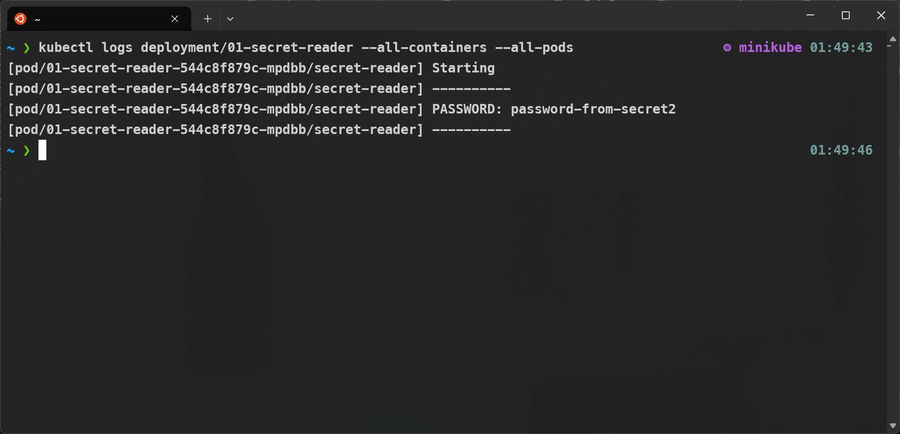
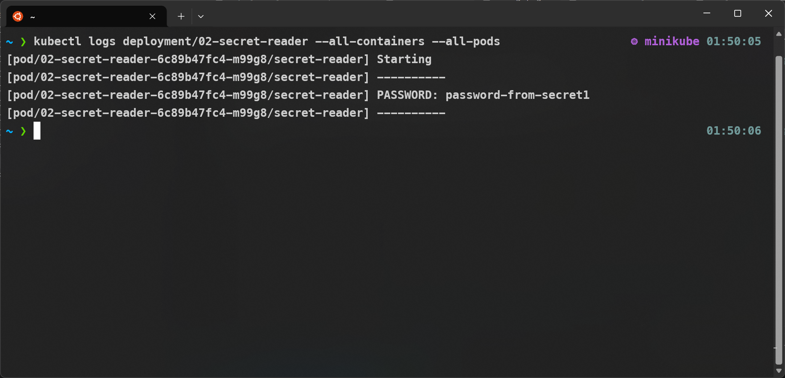
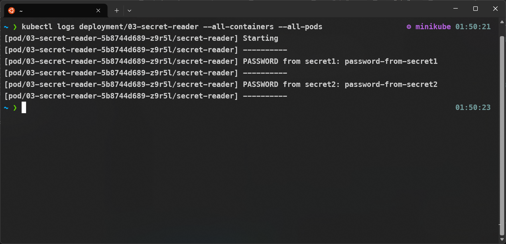
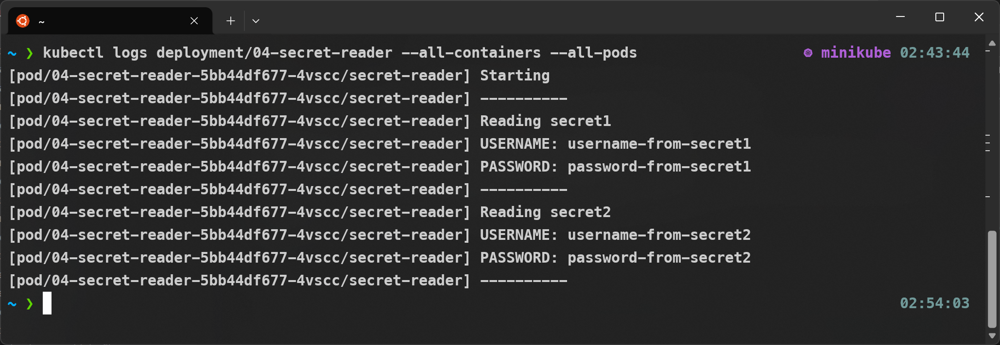
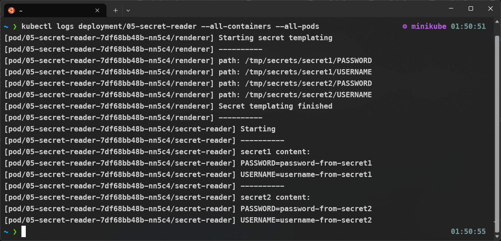
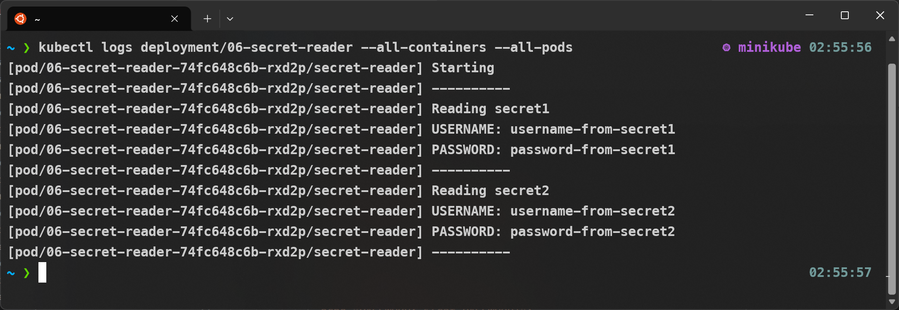
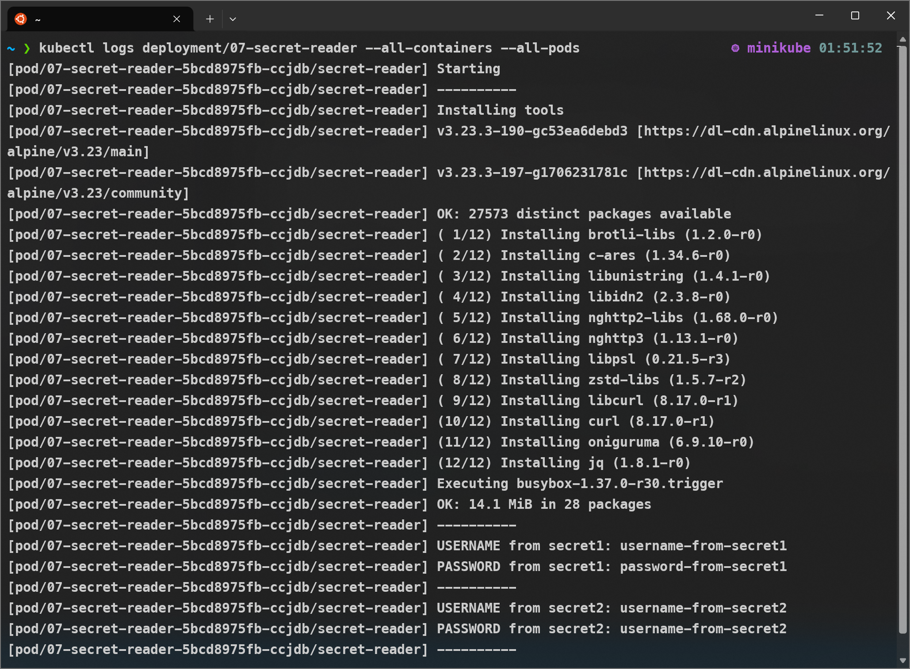

# Kubernetes Secrets Collision Demo

Say that our Kubernetes `Deployment` need to use multiple `Secrets` that contain
non-unique key name. How can we use the `Secrets`? Will they collide?

## 0. The secrets

00-secrets contain 2 `Secret`: `secret1` and `secret2`. Both contain `USERNAME` key
and `PASSWORD` key.

## 1. Secrets as environment variable

Consider this deployment spec:

```yaml
apiVersion: apps/v1
kind: Deployment
spec:
  template:
    spec:
      containers:
        - name: secret-reader
          envFrom:
            - secretRef:
                name: secret1
            - secretRef:
                name: secret2
```

Note that `secret2` is referred last. If we run
```shell
echo "PASSWORD: ${PASSWORD}";
```
from what `Secret` is the value sourced?

---

```shell
kubectl apply -k 01-env-vars-collision-1
kubectl logs deployment/01-secret-reader --all-containers --all-pods
```

Result:


In conclusion, the later `Secret` is overwriting the former one.

## 2. Secrets as environment variable with reversed order

Now let's reverse the secrets order.

```yaml
apiVersion: apps/v1
kind: Deployment
spec:
  template:
    spec:
      containers:
        - name: secret-reader
          envFrom:
            - secretRef:
                name: secret2
            - secretRef:
                name: secret1
```

Note that `secret1` is referred last.

```shell
kubectl apply -k 02-env-vars-collision-2
kubectl logs deployment/02-secret-reader --all-containers --all-pods
```

Result:


Again, the later `Secret` is overwriting the former one.

## 3. Secrets as environment variable with prefix

To prevent collision, we can use prefix to be addedd the environment variables key name:

```yaml
apiVersion: apps/v1
kind: Deployment
spec:
  template:
    spec:
      containers:
        - name: secret-reader
          envFrom:
            - secretRef:
                name: secret1
                prefix: SECRET1_
            - secretRef:
                name: secret2
                prefix: SECRET2_
```

So now we can refer the keys as
```shell
echo "PASSWORD from secret1: ${SECRET1_PASSWORD}";
echo "PASSWORD from secret2: ${SECRET2_PASSWORD}";
```
instead of using `USERNAME` and so on, without overwriting any values.

```shell
kubectl apply -k 03-env-vars-prefixed
kubectl logs deployment/03-secret-reader --all-containers --all-pods
```

Result:


Indeed, we can read values from each `Secrets`.

## 4. Secrets as mounted files

Maybe you don't like that the key names are changed in the previous configuration.
You can mount each `Secrets` as files to different paths to preserve the key name.
Each key will be mounted as a single file.

```yaml
apiVersion: apps/v1
kind: Deployment
spec:
  template:
    spec:
      containers:
        - name: secret-reader
          volumeMounts:
            - name: secret1-volume
              readOnly: true
              mountPath: /etc/secrets/secret1
            - name: secret2-volume
              readOnly: true
              mountPath: /etc/secrets/secret2
      volumes:
        - name: secret1-volume
          secret:
            secretName: secret1
        - name: secret2-volume
          secret:
            secretName: secret2
```

`PASSWORD` in `secret1` will be mounted as a plain text file in `/etc/secrets/secret1`,
and so on. You can read each secret with something like:

```shell
echo "Reading secret1"
cd /etc/secrets/secret1;
echo "USERNAME: $(cat USERNAME)";
echo "PASSWORD: $(cat PASSWORD)";

echo "Reading secret2"
cd /etc/secrets/secret2;
echo "USERNAME: $(cat USERNAME)";
echo "PASSWORD: $(cat PASSWORD)";
```

IMO this is still analoguous to the prefix approach though, with the directory acts like
a prefix to the file name. Interestingly, object storages do use prefix to simulate directory.

Now let's see the result:

```shell
kubectl apply -k 04-mounted-multiple-files
kubectl logs deployment/04-secret-reader --all-containers --all-pods
```

Result:


So we can prevent collisions and still retain the original key name.
However, maybe it is undesirable to change the implementation of reading the secret
from reading an environment variable to reading a file from disk.

## 5. Each secrets as a single mounted file

Note that in the previous example each key is mounted as a single file.
Maybe you prefer if they are formatted into a single file, like the commonly-used
dontenv files.

We can use an `initContainer` to render each `Secret` into a dotenv file.

```yaml
apiVersion: apps/v1
kind: Deployment
spec:
  template:
    spec:
      initContainers:
        - name: renderer
          image: alpine
          command:
            - sh
            - -c  
            - |
              for path in /tmp/secrets/**/*; do
                echo "path: ${path}";
                secretfile="$(dirname ${path} | sed -e 's/\/tmp\//\/etc\//').env";
                echo "$(basename ${path})=$(cat ${path})" >> ${secretfile};
              done;
          volumeMounts:
            - name: secret1-volume
              mountPath: /tmp/secrets/secret1
            - name: secret2-volume
              mountPath: /tmp/secrets/secret2
            - name: secret-rendered-volume
              mountPath: /etc/secrets
      volumes:
        - name: secret1-volume
          secret:
            secretName: secret1
        - name: secret2-volume
          secret:
            secretName: secret2
        - name: secret-rendered-volume
          emptyDir: {}
```

Beside the two `Secrets` as volumes, will use additional volume to write the rendered
secret. Note that a volume from a `Secret` is read-only, so we can not use it to write
files.

We first read each mounted secret, such as `/tmp/secrets/secret1/PASSWORD`.

We use `dirname` to extract the directory (`/tmp/secrets/secret1`), then pipe it
to sed to replace the `/tmp/` with `/etc/`, then we add suffix `.env` so we get
`/tmp/secrets/secret1.env`. We will render the dotenv file into this path that lives
in the `secret-rendered-volume`.

We use `basename` to extract the key name of the secret (`PASSWORD`), then we read
the file content with `cat`. We then append the secret with `key=value` format to the
dotenv file.

After rendered, we attach the `secret-rendered-volume` to the main container:

```yaml
apiVersion: apps/v1
kind: Deployment
spec:
  selector:
  template:
    spec:
      containers:
        - name: secret-reader
          command:
            - sh
            - -c  
            - |
              cat /etc/secrets/secret1.env;
              cat /etc/secrets/secret2.env;
          volumeMounts:
            - name: secret-rendered-volume
              mountPath: /etc/secrets
              readOnly: true
      volumes:
        - name: secret-rendered-volume
          emptyDir: {}
```

Now let's see the result:

```shell
kubectl apply -k 05-mounted-multiple-files
kubectl logs deployment/05-secret-reader --all-containers --all-pods
```

Result:


Now we don't fewer file to be read than before. The app must be able to parse the file,
though.

## 6. Using projected volume

Previously, we use one volume for each `Secret`. We can use `projected volume` to use
a single volume with multiple secret sources. However, we need to specify mounted path
of each key to prevent collision.

```yaml
apiVersion: apps/v1
kind: Deployment
spec:
  template:
    spec:
      containers:
        - name: secret-reader
          volumeMounts:
            - name: secrets-volume
              readOnly: true
              mountPath: "/etc/secrets"
      volumes:
        - name: secrets-volume
          projected:
            sources:
              - secret:
                  name: secret1
                  items:
                    - key: USERNAME
                      path: secret1/USERNAME
                    - key: PASSWORD
                      path: secret1/PASSWORD
              - secret:
                  name: secret2
                  items:
                    - key: USERNAME
                      path: secret2/USERNAME
                    - key: PASSWORD
                      path: secret2/PASSWORD
```

Now let's see the result:

```shell
kubectl apply -k 06-mounted-multiple-files
kubectl logs deployment/06-secret-reader --all-containers --all-pods
```

Result:


The result is identical with the example 4, with less volume to be managed.

## 7. Directly use Kubernetes API to get secret

It is also possible to directly query Kubernetes API for the `Secrets` content
without exporting the secrets as environment variable or mounting as files.

It is also more complex:

  1.  The pod should be configured to use a dedicated `ServiceAccount`.
      When not specified, the pod will use its namespace's default service account,
      which is not the best practice.

      ```yaml
      apiVersion: apps/v1
      kind: Deployment
      spec:
        template:
          spec:
            serviceAccountName: 07-secret-reader
            containers:
              - name: secret-reader
      ```

  2.  The service account must be granted read access to the required secrets.
      We should limit the allowed resource to be accessed only to the bare minimum.
      A `Role` authorizes an antity to do some actions; a `RoleBinding` binds an entity
      to a `Role`. A `Role` and `RoleBinding` are namespaced resources; `ClusterRole`
      and `ClusterRoleBinding` are their cluster-wide counterpart.

      ```yaml
      apiVersion: rbac.authorization.k8s.io/v1
      kind: Role
      metadata:
        name: 07-secret-reader-role
        namespace: default
      rules:
        - apiGroups:
            - ""
          resources:
            - secrets
          resourceNames:
            - secret1
            - secret2
          verbs:
            - get
      ---
      apiVersion: rbac.authorization.k8s.io/v1
      kind: RoleBinding
      metadata:
        name: 07-secret-reader-role-binding
        namespace: default
      roleRef:
        apiGroup: rbac.authorization.k8s.io
        kind: Role
        name: 07-secret-reader-role
      subjects:
      - kind: ServiceAccount
        name: 07-secret-reader   
      ```

  3.  By default (when `Pod`'s `spec.automountServiceAccountToken` is not set
      to `false`), Kubernetes will mount the `ServiceAccount`'s namespace name, token,
      and API server certificate bundle to
      `/var/run/secrets/kubernetes.io/serviceaccount`.
  
      The token is used to authorized the `Pod` to the API server. subjected to the
      authorization specified by the above `Role` and `RoleBinding`.
      
      The certificate bundle is used to allow a HTTPS client to trust the API server
      when establishing TLS connection, since the API server is using a self-signed
      certificate (altough the client is free to just ignore the insecure connection,
      such as when using `curl -k`).
  
      The API path to query the `Secret` is
      `https://kubernetes.default.svc/api/v1/namespaces/<namespace-name>>/secrets/<secret-name>`

      The response is in JSON format, and the `spec.data[]` entries are in
      base64-encoded format.


      ```shell
      # Point to the internal API server hostname
      APISERVER=https://kubernetes.default.svc;

      # Path to ServiceAccount token
      SERVICEACCOUNT=/var/run/secrets/kubernetes.io/serviceaccount;
      
      # Read this Pod's namespace
      NAMESPACE=$(cat ${SERVICEACCOUNT}/namespace);
      
      # Read the ServiceAccount bearer token
      TOKEN=$(cat ${SERVICEACCOUNT}/token);
      
      # Reference the internal certificate authority (CA)
      CACERT=${SERVICEACCOUNT}/ca.crt;

      get_secret() {
        local secret;
        secret=$(curl -s --cacert ${CACERT} --header "Authorization: Bearer ${TOKEN}" -X GET ${APISERVER}/api/v1/namespaces/$1/secrets/$2);
        echo ${secret} | jq -r ".data.$3 | @base64d";
      };

      echo "USERNAME from secret1: $(get_secret ${NAMESPACE} secret1 USERNAME)";
      ```

Now let's see the result:

```shell
kubectl apply -k 07-mounted-multiple-files
kubectl logs deployment/07-secret-reader --all-containers --all-pods
```

Result:
